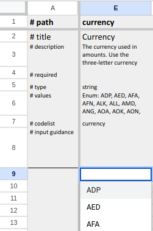
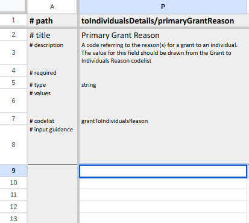
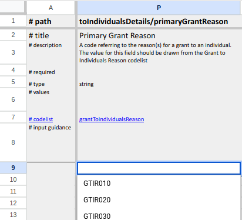
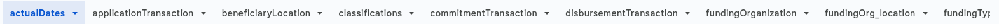
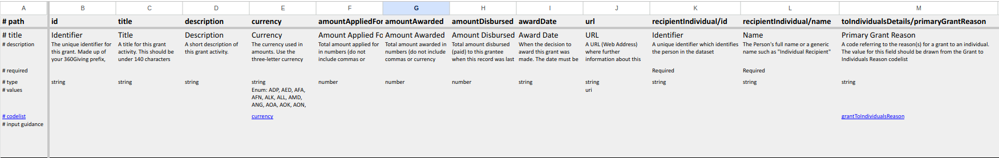
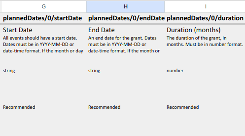
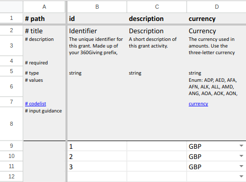
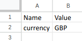
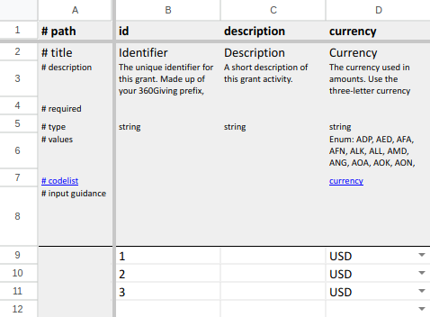

# Tutorial

In this tutorial, you'll create user-friendly spreadsheet template for the 360Giving Data Standard schema. Along the way, you'll create a reusable [configuration file](cli.md#configuration-file) so that you can recreate the template if the schema changes.

## Get set up

First, [install the spreadsheet generator](get_started.md).

Then, download the [360Giving Data Standard Schema](https://standard.threesixtygiving.org/en/latest/_static/360-giving-schema.json):

```bash
curl -O https://standard.threesixtygiving.org/en/latest/_static/360-giving-schema.json
```

### Create a basic template

To create a basic template, run the `create-template` command and pass the filename of the schema. 

```bash
python manage.py create-template 360-giving-schema.json --rollup
```

The template is saved to a file named `template.xlsx`. Open it in your preferred spreadsheet package and take a look at the worksheet named `main`.

### Add drop-down lists for open codelists

Notice that there's a drop-down list for the `currency` field, but not for fields that reference open codelists, like `toIndividualsDetails/primaryGrantReason`?





That's because we need to specify a URL from which the codelist CSV files can be fetched. We should also specify the url at which codelist documentation is available:

```bash
python manage.py create-template 360-giving-schema.json --rollup --codelist-base-url https://raw.githubusercontent.com/ThreeSixtyGiving/standard/master/codelists/ --codelist-docs-url https://standard.threesixtygiving.org/en/latest/technical/codelists/
```

Recreate the template using the above command and look at the `main` worksheet again. You should see a drop-down list for `toIndividualDetails/primaryGrantReason` and a link to the codelist documentation:



### Specify which sheets to include

There are a lot of worksheets because the template includes all of the fields in the schema.



We want the template to be user friendly, so lets remove all but the main worksheet, which represents the top-level object in the schema.

Open `config.yaml` in a text editor and add `- main` to the `sheets` section:

```yaml
sheets:
# An ordered list of sheets to include in the template, e.g.
# - sheet1
# - sheet2
# If not specified, all sheets ouput by Flatten Tool are included in alphabetical order.
- main
```

Instead of passing the `--rollup`, `--codelist-base-url` and `--codelist-docs-url` options each time we run the command, we can set values for these options in the configuration file:

```yaml
codelist_base_url: https://raw.githubusercontent.com/ThreeSixtyGiving/standard/master/codelists/
codelist_docs_url: https://standard.threesixtygiving.org/en/latest/technical/codelists/
rollup: true
```

Now, let's create a template using the configuration file:

```bash
python manage.py create-template 360-giving-schema.json -c config.yaml
```

Ignore the warnings about skipped sheets and re-open `template.xlsx` in your spreadsheet package.

Now we have a single worksheet, but there's still a lot of columns:



### Specify which fields to include

Let's further simplify the template by specifying a subset of fields from the schema in `config.yaml`:

```yaml
include_fields:
# A list of fields to include in the template. When set, all other fields in the schema are omitted from the template. Specify fields using JSON Pointer syntax, e.g.
# - path/to/field
# - path/to/array/0/field
# You cannot set both include_fields and exclude_fields in the same config file.
- id
- description
- currency
- amountAwarded
- awardDate
- plannedDates/0/startDate
- plannedDates/0/endDate
- plannedDates/0/duration
- recipientOrganization/0/id
- recipientOrganization/0/name
- recipientOrganization/0/charityNumber
- recipientOrganization/0/companyNumber
- recipientOrganization/0/postalCode
- fundingOrganization/0/id
- fundingOrganization/0/name
- grantProgramme/0/title
- beneficiaryLocation/0/name
- dateModified
- dataSource
```

Recreate the template using the updated configuration file:

```bash
python manage.py create-template 360-giving-schema.json -c config.yaml
```

### Add user guidance

The template already shows which fields are required (mandatory). In JSON Schema, all other fields are optional, but what if we want to recommend that users populate some of the optional fields?

We can specify per-field user guidance by adding a `user_guidance` section to our configuration file:

```yaml
field_guidance:
  plannedDates/0/startDate: Recommended
  plannedDates/0/endDate: Recommended
  plannedDates/0/duration: Recommended
  recipientOrganization/0/charityNumber: Recommended
  recipientOrganization/0/companyNumber: Recommended
  recipientOrganization/0/postalCode: Recommended
  grantProgramme/0/title: Recommended
  beneficiaryLocation/0/name: Recommended
```

Recreate the template using the same command as in previous steps and open it in your spreadsheet package. Notice how the guidance specified for each field appears on the `# input guidance` row:



### Specify fixed values

To make our template even easier to use, we can specify a fixed value for the `currency` field so that users don't need to enter the same information for each row of data that they enter:

```yaml
fixed_values:
  currency: GBP
```

Recreate the template and notice try entering some data in cells B9, B10 and B11. Notice how the `currency` field is populated automatically.



### Specify user-editable variables

What if we want spreadsheet users to choose their own currency? We can specify a user-editable `currency` variable with a default value of 'GBP' in our configuration file:

```yaml
variables:
  currency: GBP
```

Recreate the template and notice that there is now an extra `# Variables` sheet which includes our user editable variable.



Now, we can use this variable in a custom formula to set the value of the `currency` field. First, remove the `fixed_value` entry for `currency` that we added in the previous step, then add the following formula:

```yaml
formulae:
  currency: =IF(B{row}="","",currency)
```

Recreate the template, change the value of the `currency` variable to 'USD' and enter some data in cells B9, B10 and B11 of the main sheet. Notice how the `currency` column is populated automatically using the formula above.



